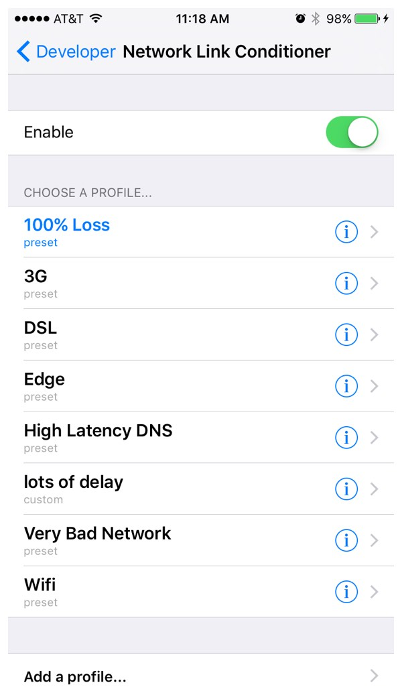

## Use Network Link Conditioner to simulate adverse networking environments

`Network Link Conditioner` allows Mac and iOS devices to accurately and consistently simulate adverse networking environments.（**just don’t forget to turn it off after you’re done testing!**）

The Network Link Conditioner can change the network environment of the iOS Simulator according to one of the built-in presets：

* EDGE
* 3G
* DSL
* WiFi
* High Latency DNS
* Very Bad Network
* 100% Loss

Refer from [http://nshipster.com/network-link-conditioner/](http://nshipster.com/network-link-conditioner/ )

## Enable Network Link Conditioner on iOS Devices

### 1、Enable Develoopment mode on iOS with Xcode

* Connect your iPhone or iPad to your Mac

* In Xcode, go to Window > Devices and Simulators（⇧⌘2）

* Select your device in the sidebar

* Click “Use for Development”

### 2、Then, Configuration `Network Link Conditioner` on your iOS Device

a. Setting App > Developer > Network Link Conditioner.

b. Turn `Network Link Conditioner` on, select a profile for the connection.

c. And add or edit profiles.

