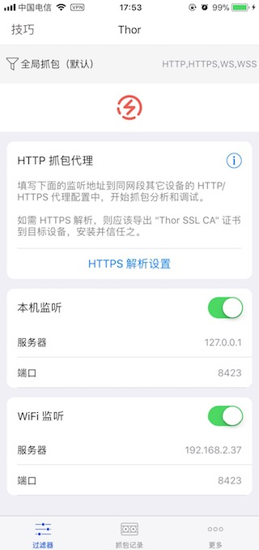
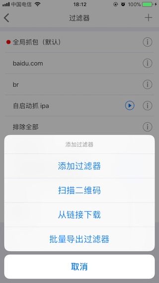
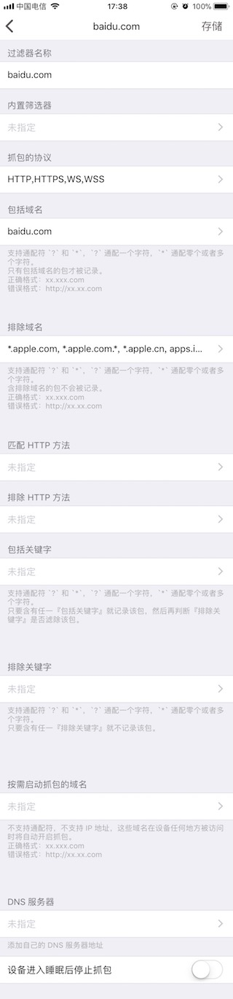
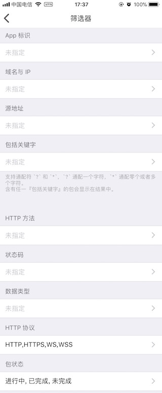
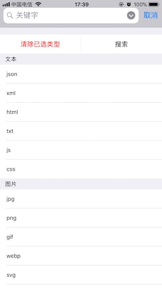

## Thor HTTPS 抓包分析，开发调试利器 for iOS


iOS 端强力专业的 HTTPS 抓包分析 & 开发调试利器 - Thor 

其它语言: [English](README.md)

[去 App store 下载](https://itunes.apple.com/app/id1210562295)

另外两个作品 Anubis, Shu，跟 Thor 搭配使用，获得最佳体验, [买 Thor 送 Anubis + Shu 同捆包](https://itunes.apple.com/app-bundle/id1379995720)


[Product Hunt 应用主页](https://www.producthunt.com/posts/thor)


欢迎大家交流讨论抓包技巧：[官推](https://twitter.com/thor_pixelcyber)、[tg 群](https://t.me/thorshu)、<!-- [tg 频道](https://t.me/thornotice) -->

[**使用技巧 >>**](tips-zh-Hans/dev_tip.md)

[**常见问题 >>**](demo-zh-Hans/demo_list.md)


### 申请 20 天免费体验 Thor TestFlight

- 填写问卷：[https://wj.qq.com/s/1607760/e57d](https://wj.qq.com/s/1607760/e57d)


### 优势：稳，好，强

- 断点调试
```
支持对请求头，请求消息体，响应头，响应消息体的全部内容下断点调试
```

如：[利用断点调试向 WebView 注入调试脚本](tips-zh-Hans/breakpoint.md)

- 免配 HTTPS 域名，自动解析所有 HTTPS 流量
```
高性能实时解析，自动命中机制，减少 HTTPS 解析失败时对正常网络的影响
```

- 支持 WiFi 局域网代理（抓取其他设备的 HTTP(S) 流量）
```
无需电脑，随时抓包，手机安装随处使用，还是熟悉的过滤器
```
[wifi 代理设置，如图](res/wifi_proxy.jpg)

<!--  -->

- 独创的过滤器筛选技术（f4thor），让你一键得到目标数据
```
得益于 Thor 灵活全面的过滤器和筛选器配置规则，数据过滤和数据分析从未如此简单
导出自己的过滤器配置，抓包数据，共享工作成果，让小白也能享受到他人精心配置的过滤器
```
[过滤器管理及导出导入，如图](res/sessin_filter_export.jpg)

<!--  -->


[灵活的过滤器配置项，如图](res/session_filter.jpg)

<!--  -->


[丰富的筛选器条件，如图](res/packet_filter.jpg)

<!--  -->


[抓包记录搜索，如图](res/search.jpg)

<!--  -->


- 最全面的 HTTP body 解析，预览及分析支持
```
支持几乎所有常见文件类型的解析、解压缩和预览
```

- 全面专业的数据格式导出支持
```
行业标准的 har, cURL 格式批量导出

Thor 独创的 p4thor 记录格式让包记录协作分析和共享备份变得简单快捷
```
[抓包记录导出导入，如图](res/packet_export.jpg)

<!--  -->

- 超强的性能和高稳定性让 iOS9 也能发挥极致
```
超长时间持续稳定运行，成千上万的数据实时记录
```


### 功能


### Thor 是 HTTP 抓包调试工具，不支持任何科学上网功能，请知晓

灵活强大的过滤，筛选规则配置：
- 支持按域名，关键字等配置过滤
- 抓到的结果支持各种条件的筛选
- 关键字搜索（搜索范围：请求头+响应头）
- 过滤规则 f4thor 导入导出（轻松使用别人分享的过滤器配置）

三方 App 文件查看及解压
- 常见文件查看
- 证书预览及格式转换及导出（der, pem, p12）
- 解压(含密码)：zip, rar, 7z, tgz, tar, bz, tbz, gz, lz4
- 字体文件显示效果预览

自动解析包数据：
- 自动解析 HTTP 消息体
- 文本自动语法高亮
- 支持导出原始请求数据
- 包记录添加备注

强悍优异的性能：
- 边抓边看，请求的生命周期状态实时更新
- 轻松实时记录成千上万个 HTTP 请求
- 长时间持续抓包也不会对网络日常使用造成影响
- iOS9 上也能持续稳定工作

HTTP(S) 抓包：
- 本机、WiFi 局域网抓包
- HTTPS 高性能实时解析
- HTTP pipelining
- websocket 流量抓取
- cURL, .har, .f4thor, p4thor 导入导出
- 其它来源的非标准 .har 文件可以导入 thor，再导出，就标准了
- 通知中心的 HTTP 抓包 widget 可实时查看当前包记录
- 抓包过程中支持一键清空当前记录
- iPad 分屏抓包
- 请求包支持文本备注和收藏


**不支持抓取 TCP，UDP 流量**