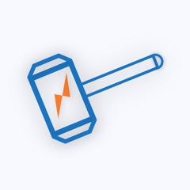

## Thor for iOS

iOS 端强力专业的 HTTPS 抓包分析工具 - Thor

[去 App store 下载](https://itunes.apple.com/app/id1210562295)

其它语言: [English](README.md).

欢迎大家交流讨论抓包技巧：[官推](https://twitter.com/thor_pixelcyber)、[tg 群](https://t.me/thorshu)、[tg 频道](https://t.me/thornotice)

### 特点

- 独创的过滤器筛选技术（f4thor），让你一键得到目标数据
- 最全的 HTTP 数据自动解析及分析支持
- 全面专业的数据格式导出支持
- 超强的性能和高稳定性让 iOS9 也能发挥极致

### 免费参加 TestFlight 体验 Thor 途径

- 填写问卷：[https://wj.qq.com/s/1607760/e57d](https://wj.qq.com/s/1607760/e57d)

[**Thor 的使用技巧 >>**](demo-zh-Hans/demo_list.md)

### 功能

Thor 无法与其它『微屁恩』同时打开，不支持任何科学上网功能。

灵活强大的过滤，筛选规则配置：
- 支持按域名，关键字等配置过滤
- 抓到的结果支持各种条件的筛选
- 关键字搜索
- 过滤规则 f4thor 导入导出（轻松使用别人分享的过滤器配置）

三方 App 文件查看及解压
- 常见文件查看
- 证书预览及格式转换导出及安装到系统（der, pem, p12）
- 解压(含密码)：zip, rar, 7z, tgz, tar, bz, tbz, gz, lz4
- 字体文件预览

自动解析包数据：
- 自动解析 HTTP 消息体为常见媒体形式
- 支持导出原始请求数据
- 包记录添加备注

强悍优异的性能：
- 边抓边看，请求的生命周期状态实时更新
- 轻松实时记录成千上万个 HTTP 请求
- 保持整天打开也不会对网络日常使用造成影响
- iOS9 上也能持续稳定工作

HTTP(S) 抓包：
- HTTPS 高性能实时解析
- HTTP pipelining
- websocket 流量抓取
- cURL, .har, .f4thor, p4thor 导入导出
- 通知中心的 HTTP 抓包 widget 可实时查看最新抓到的包
- 抓包过程中支持一键清空当前记录
- iPad 分屏抓包
- 请求包支持文本备注和收藏

**暂不支持抓取 TCP，UDP 流量**