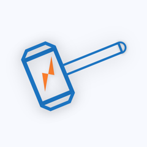

# Thor for iOS

HTTP sniffer tool on iOS - Thor，for developers.

[Download from App store](https://itunes.apple.com/app/id1210562295)

Read in other language: [简体中文](README.zh-cn.md).

### Join beta test on TestFlight for free

* Next public test is coming soon.

<!-- * Send your email address to beta@pixelcyber.com. -->

<!-- * [Create issues](https://github.com/PixelCyber/Thor/issues/new) and paste your email address. -->

### Features

#### Image perview support

* `jpg, png, gif, webp, apng, jp2, tiff, bmp, ico, icns`

* `svg, psd`

#### Compression file extract support

* `zip, rar, 7z, tgz, tar, bz, tbz, gz`

#### Excellent performance

* thousands of packets logged without pressure

* keeping Thor active all day without any side effect

#### Auto decoding packet content

* decoding HTTP body to human readable data

#### Flexible filter rules

* filter packets by domains, keywords

#### Realtime sniffer

* packet status update in real-time
* log latest packets on widget in notification center

**HTTPS decoding is on the way**