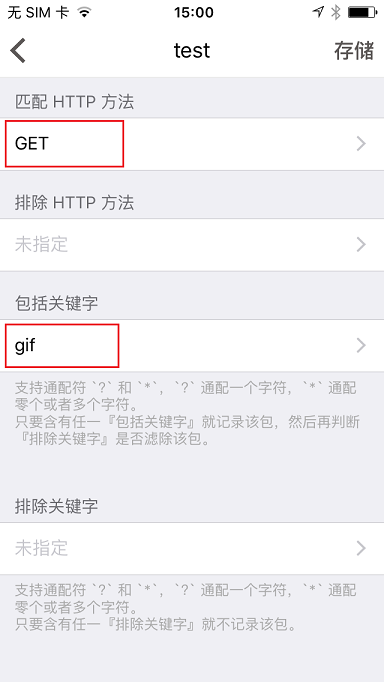

# iOS 端使用 Thor 抓包微博 GIF 图

公测时有小伙伴说不知道 `Thor` 怎么用，本文简单介绍下用 `Thor` 抓取微博 `GIF` 图。（同理，抓取视频之类的，或者其它 APP 的内容）

欢迎大家加入 `Thor` 官方 qq 群：**577198244**，探讨 `Thor` 的各种用法。

### **1.准备工作**
在 [AppStore](https://itunes.apple.com/app/id1210562295) 下载 [Thor](https://itunes.apple.com/app/id1210562295)

### **2.设置过滤器**
打开 `Thor App`，点击选择过滤器项进入过滤器页面，点击 `+` 添加过滤器。

- 过滤器名称任写，不能为空
- 抓包支持协议默认为 `http&https` ，这里可选 `http`（软件初版暂不支持 `https` 解析）
- 包括域名，填写 `sinaimg.cn` （不知道具体域名时可不填写，不支持通配符）
- 匹配 `http` 方法，这里是要获取 `GIF` 图，所以可选择 `get` 方法
- 包括关键字，我们要获取 `GIF` 图，这里填写 `gif` ，过滤器就会过滤链接含 `gif` 关键字的包

设置这几项基本足够，点击保存过滤器就保存好了，接下来就是开启抓包。

### **3.抓包**
- 进入主页，选择刚才设置好的过滤器，点击开启。这里如果是第一次开启抓包会提示需要 `VPN` 权限（因为抓包软件也是相当于 `VPN` 代理），根据引导开启 `VPN`。
- 此时已开启抓包，进入**被抓包软件**。进入微博，在搜索页面搜索萌宠图片（`gif` 图较多，这里任选一张），点击想要的 `gif` 图，加载出图片。
- 开启通知中心的 `Thor 抓包插件` 或者返回 `Thor App` ，进入抓包记录界面，查看**正在抓包的会话**，会话页会显示满足过滤器条件的包的数量。
- 查看**抓到的数据包**，进入 `response` 滑动到最后查看 `body` ，就会展示返回的 gif 图片啦，如图。

基本上熟悉使用了以后还是很简单，大家有什么问题随时反馈哦。
