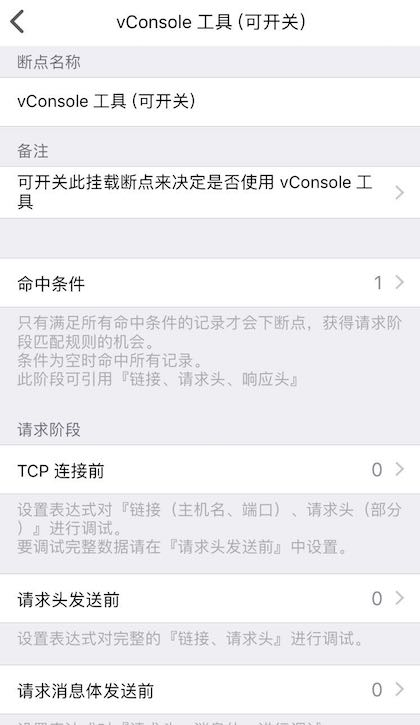
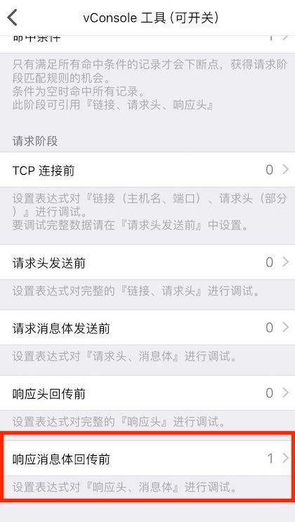
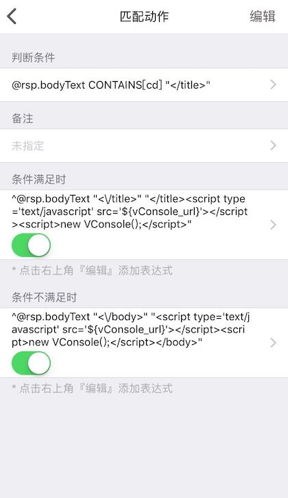
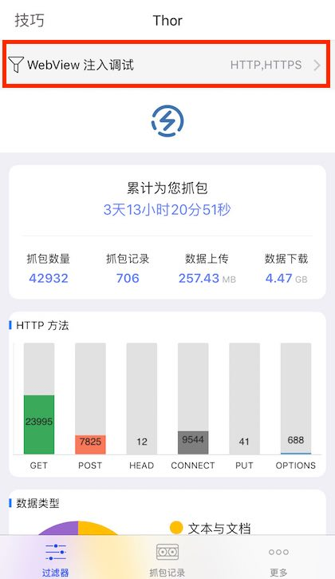
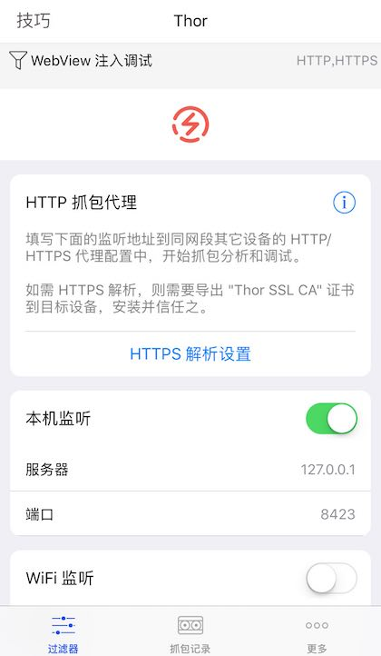
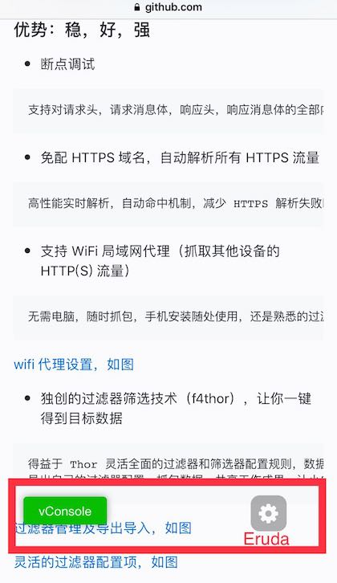
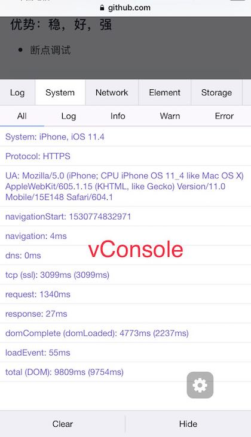
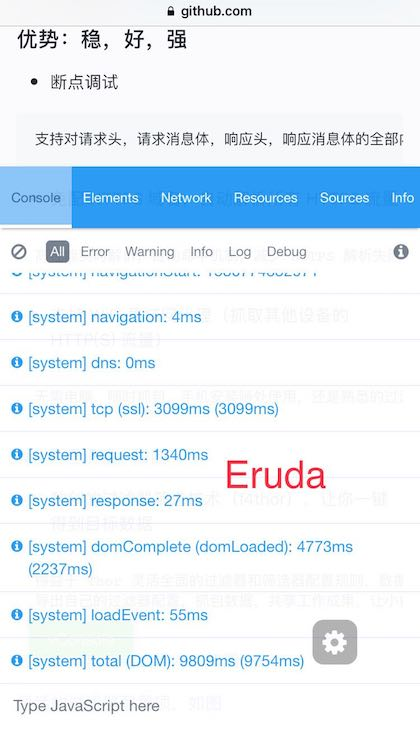

### 一种在线调试线上 app 中 WebView 的方法

#### 0x1、要解决的问题

工作中时常遇到需要对自己已上线 app 中的 WebView 网页进行一些调试验证，以排除 bug，解决问题。

#### 0x2、解决方案

利用 Thor HTTP 抓包的『断点调试』功能向 WebView 注入调试脚本。

#### 0x3、技术原理

向目标网页的 HTML 响应中注入调试脚本（文本替换）。

#### 0x4、WebView 调试示例 app

[PPHub For Github](https://itunes.apple.com/app/id1314212521) by [jkpang](https://github.com/jkpang): GitHub 第三方 iOS 客户端

#### 0x5、用到的工具

- [Thor HTTP Sniffer](https://itunes.apple.com/app/id1210562295): 抓包及断点调试

- [vConsole](https://github.com/Tencent/vConsole): A lightweight, extendable front-end developer tool for mobile web page.

- [Eruda](https://github.com/liriliri/eruda): Console for mobile browsers.


### 第一步：在 Thor 中设置过滤器断点

#### 0x1、打开 Thor, 创建一个过滤器，取名为："WebView 注入调试"，并添加一个断点进入编辑


#### 0x2、因为需要对 WebView 的响应 HTML 内容进行注入，所以选择在 `请求阶段 > 响应消息体回传前 > 新建匹配规则`

 


#### >> 选择『响应 body 前』




#### 0x3、在匹配规则中加入表达式进行替换，以注入 vConsole 工具

**因为对 HTML body 标签注入 js 脚本后可能不会总是生效，所以这里选择优先对 title 标签进行替换**

加入判断条件：判断是否包含 title 标签
``` javascript
@rsp.bodyText CONTAINS[cd] "</title>"
```

当有 title 标签时，执行以下表达式

``` javascript
^@rsp.bodyText "<\/title>" "</title><script type='text/javascript' src='https://coding.net/u/Tumblr/p/thor-lib/git/raw/master/vconsole/3.2.0/vconsole.min.js'></script><script>new VConsole();</script>"
```

没有 title 标签，则找 body 标签替换

``` javascript
^@rsp.bodyText "<\/body>" "<script type='text/javascript' src='https://coding.net/u/Tumblr/p/thor-lib/git/raw/master/vconsole/3.2.0/vconsole.min.js'></script><script>new VConsole();</script></body>"
```

- *考虑加载速度的原因，没有直接使用 github 上的 vConsole 原地址，而是 dump 了一份到 coding.net 仓库里，所以上面用的是 codeing.net 的脚本地址*


#### >> vConsole 注入设置如图




**同理，再新建一个断点，完成 Eruda 工具的注入（其实可以不用两个调试脚本都注入，这里只是演示效果）**


### 第二步：在 PPHub 中找一个 WebView 界面进行尝试

#### 0x1、打开 Thor > 选择 "WebView 注入调试" 过滤器，并启动

  

#### >> 启动抓包

 

#### 0x2、打开 PPHub

 

#### >> 并找到一个 WebView, 等待加载完成 (直到出现调试工具入口)

 


#### >> vConsole 调试效果

   

#### >> Eruda 调试效果

 


### 参考资料 (排名不分先后)

- [JSBox 的网页调试插件](https://itunes.apple.com/app/id1312014438)
- [三种解密 HTTPS 流量的方法介绍 by Jerry Qu](https://imququ.com/post/how-to-decrypt-https.html)
- [eruda - Console for mobile browsers](https://eruda.liriliri.io/)
- [vConsole by Tencent](https://github.com/Tencent/vConsole)


### Thor 20 天免费试用 TestFlight 申请

0x1、[Thor 的详细介绍](https://github.com/PixelCyber/Thor/blob/master/README-zh-Hans.md)

0x2、[TestFlight 申请问卷填写](https://wj.qq.com/s/1607760/e57d)

0x3、过滤器 "WebView 注入调试" [后期优化版下载](https://github.com/PixelCyber/Thor/raw/master/tips-zh-Hans/bp_res/WebView_debug.f4thor)（下载后直接用 Thor 打开，安装）

